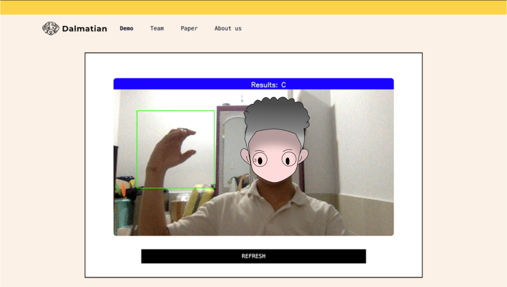

# America-Sign-Language-App-with-Flask

**Hi guys! I'm Sho0**
**This repository is a project for my university course**

## Summary:
**Project have 2 part:**
1. First one is Define and Training model made by my teamade you can follow [here](https://github.com/Harly-1506/American-Sign-languages-datasets-Classification)
2. Second is my demo it is this repo

**My demo using Flask for backend and Tailwind for Frontend moreover I use [Mediapipe](https://google.github.io/mediapipe/) for hand recognition**
**In this repo 👇:**
1. requirement.txt: That is all techich you need to run my app.
2. server.py: this is the most important part because it contain code for process and run app
3. template/ : Folder contain all html code for frontend
4. The others: Almost is static element for frontend and some result from app.


## How to run 🏃!!:
* You must to have all src code:
```bash
~ git clone https://github.com/RC-Sho0/ASL-web-demo.git
~ cd ASL-web-demo
```
* Setup enviroment:
```bash
~ pip install -r requirements.txt
```
* Run server:
```bash
~ python install server.py
```
* Open browser and connect this path:
```bash
http://127.0.0.1:5000
```

## My website look like this 



**Wow now u can using my app!!! That cool right?**

**If you like that, please Star my repo 🌟**

**And if you want to support let follows my github 🎆**


--------------------------------------------------------------
***Authorized by Sho0***
